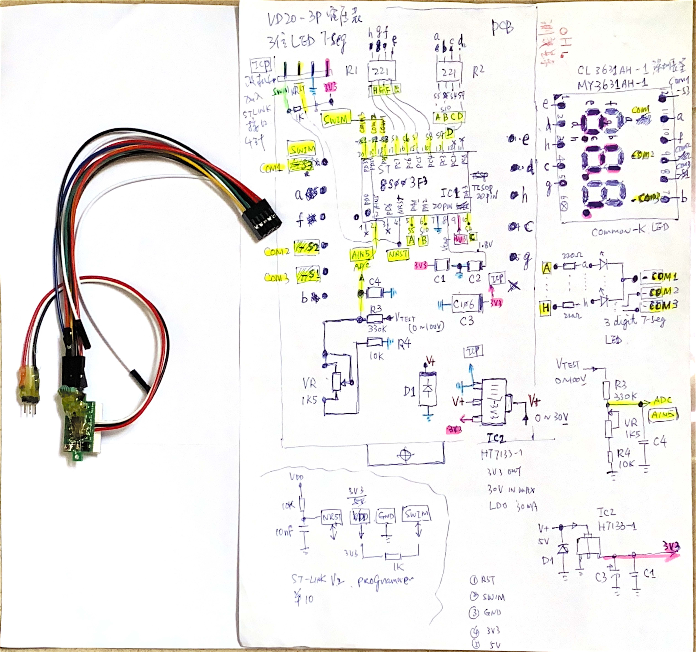
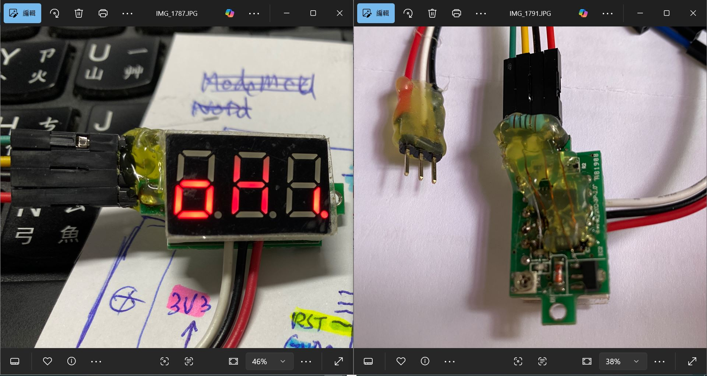
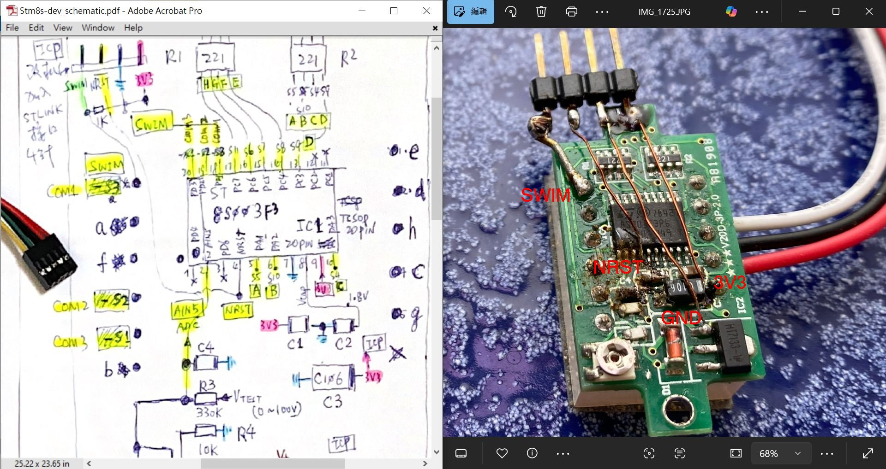
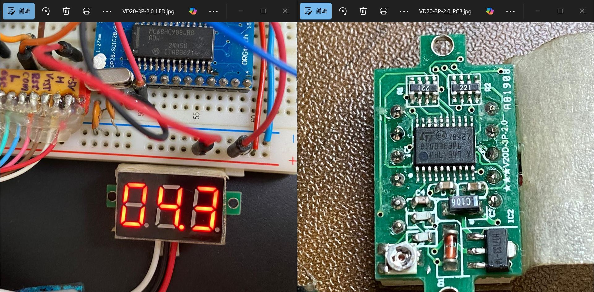
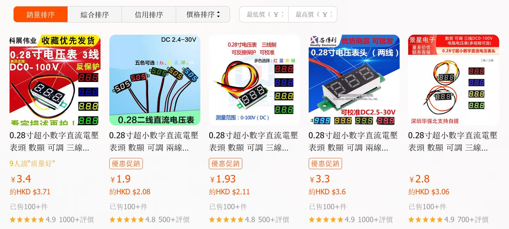

# STM8S003F3P6_V20D-3P-voltage_meter
demo, MCU STM8S003F3P6, 3digit of 7-seg LED, adc demo, V20D demo  
STM8S103 STM8S003, 差別, 1半價格, EEPROM 容量差一倍, 其他一樣.  

### firmware
say "oh hi" to the world, likely "hello world", source code avaialble.  
[V20D-3P_volt_meter_blink_oHi.hex](firmware/V20D-3P_volt_meter_blink_oHi.hex)  

voltage meter, no source code  
[working no source code, V20D-volt_meter_STM8S003F3_trimmed.s19](firmware/V20D-volt_meter_STM8S003F3_trimmed.s19)  

### schematic
[Stm8s-dev_schematic.pdf](Stm8s-dev_schematic.pdf)  


### testing result
burn firmware to the chip, will see,  
or compile the source code on your own,  


### old PCB design, how to add ICP for STLINK and programming the chip



C code, demo
[stm8s003_volt_adc.c](stm8s003_volt_adc.c)  

   

compatible prodcuts, no uses STM8S, domestic MCU, no marking at most of those,
ask before buy,  
  


Nuvoton N76E003  
深圳航顺 HK32F030MF4P6, same GPIO names  
pin-pin compatible with STM8S003F3P6  

```
国产MCU替代STM8S003方案汇总  
https://blog.csdn.net/weixin_41565556/article/details/114170025  
  
国产，未来之星！呕心收集！  
总结下，能代替的有：  

8051 core
深圳赛元SC92F8003X20U ：https://www.socmcu.com/index.php?m=Product&a=index&bid=59  
深圳航顺HK8S003P : http://www.hsxp-hk.com/companyfile/1/  
上海芯圣HC89S003F4P6：http://www.holychip.cn/product1.php?class_id=101101101  

ARM M0 core
深圳爱普特APT32F003F6P6：http://www.aptchip.com/Article/Equipment.aspx?cid=67&nid=25  
上海华大HC32F003：https://www.hdsc.com.cn/Category83  
合肥恒硕CX32L003：http://zbitsemi.com/m/display.php?id=44  
深圳航顺HK32F030MF4P6 : http://www.hsxp-hk.com/product/24.html
  
前3种是51内核，后面是arm的M0内核  
————————————————  
版权声明：本文为博主原创文章，遵循 CC 4.0 BY-SA 版权协议，转载请附上原文出处链接和本声明。  

原文链接：https://blog.csdn.net/weixin_41565556/article/details/114170025  
```


REF:
如果是STM8S的, 想自行改一下控制功能,  

STM8S 的有開發工具, 說明合適給 STM8S103, 作者也明顯說明合適給 stm8s003, 用普通的 ARDUINO 就可以  

https://tenbaht.github.io/sduino/hardware/stm8s003/  
